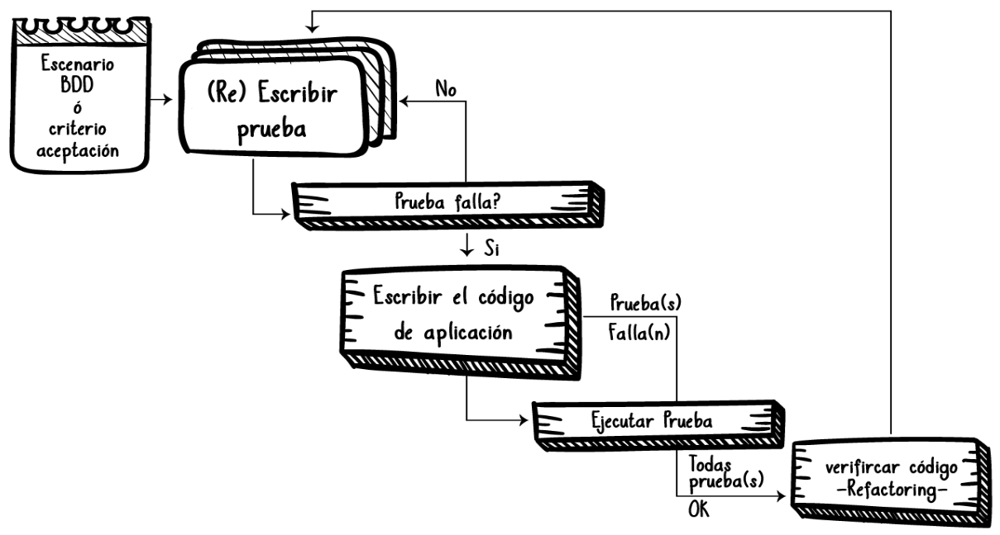

# TDD

## Hablemos un poco de TDD

TDD o Desarrollo dirigido por pruebas es un método en el desarrollo de software que entrelaza las pruebas unitarias, la programación y la refactorización.

## Las 3 reglas del TDD

Habrá quizá muchas otras pero las 3 reglas de [Robert C. Martin](http://butunclebob.com/ArticleS.UncleBob.TheThreeRulesOfTdd) son bastante buenas para saber cómo va ese TDD. Y son estas:

> No escribirás código de producción sin antes escribir un test que falle.

> No escribirás más de un test unitario suficiente para fallar (y no compilar es fallar).

> No escribirás más código del necesario para hacer pasar el test.

Siempre piensa en **QUE** se necesita\
Luego elabora planes para para llevarlo a cabo (el **COMO**)\
Y como valor agregado con TDD la prueba ya queda escrita y será sumada a las demás pruebas y estas serán ejecutadas, en forma de regresión, cada vez que queramos hacer una compilación

Las pruebas resultantes son una muy buena fuente para entender el código incluso mejor que cualquier **documentación**.

## Tarea 3: Pasemos de rojo (RED) a verde (GREEN)

Seleccionado el criterio de aceptación más simple que se pueda y traducido a una prueba unitaria, debemos comprobar que la prueba falle, de lo contrario, hay que sobreescribir la prueba

### El Ciclo Red-Green-Refactor

<span style="color:#C9514B; font-style:italic">Rojo:</span> hacer que la prueba falle (Tarea 2)

<span style="color:#13D162; font-style:italic">Verde:</span> hacer que la prueba pase (Tarea 3)

<span style="color:#51D6FF; font-style:italic">Refactor:</span> aplicar buenas prácticas de codificación una vez el código hace lo que queremos que haga (Tarea 4)

Veamos:


<!--  -->

<p style="color:#51D6FF; font-weight:bold; text-align:center">Una vez realizado el refactoring, es importante <span style="text-decoration:underline">antes de escribir nuevo código</span>, ejecutar nuevamente las <span style="text-decoration:underline">pruebas</span> y todas deben estar <span style="text-decoration:underline">en verde</span></p>

1. Crear el mínimo código posible que solucione el error en la prueba

    **Quick fix:** `ctrl+.` ó `hover` sobre el error en la prueba y click en `Quick Fix...`

    Solución rápida\
    

    Resultado de solución VSCode\
    

2. Correr las pruebas y validar si la prueba ya pasa (Verde)

    `npm run test`\
    

3. Corregir método `add` cambiando el `throw` por un `return` con el resultado esperado

    ```javascript
    function add(arg0: string, arg1: string): any {
    	return "II";
    }
    ```

4. Correr las pruebas y validar que la prueba, <span style="color:#13D162; font-style:italic">ya pasa</span>

    `npm run test`\
    

5. Antes de pasar a la siguiente tarea, pensemos...
    - **¿Que cosas no están tan bien, a pesar que ya pasa la prueba?**\
       Tener en cuenta que
        - Todavía no pensamos la siguiente prueba
        - En todo momento debemos enfocarnos en lo realmente importante y no sobre diseñar
        - No se debe crear código nuevo, porque no hay una prueba que falle

**[Siguiente Tarea](../../../../tree/workshop-detail/4/workshop)**

[Ceiba Software House S.A.S. © 2016](https://www.ceiba.com.co/)

Certified Scrum Developer Course, Lab Guide
